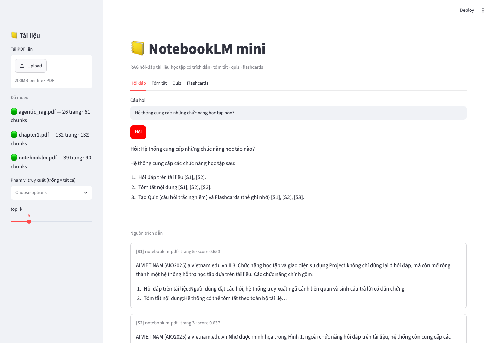
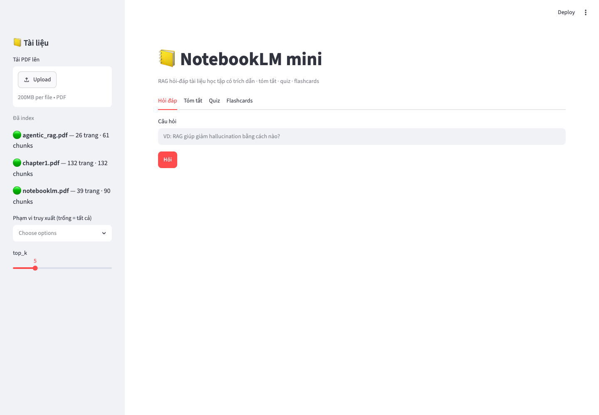
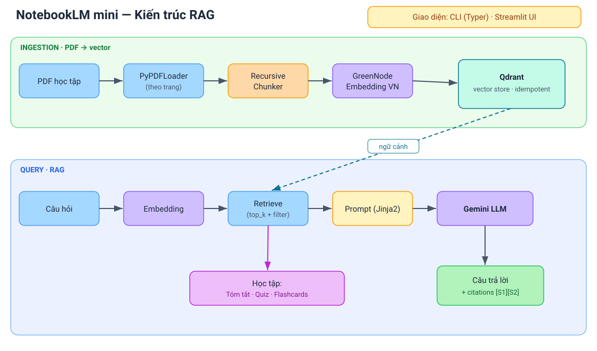

# 📒 NotebookLM mini — RAG for Learning System

Hệ thống hỏi-đáp tài liệu học tập theo kiến trúc **Retrieval-Augmented Generation (RAG)**:
nạp PDF của bạn → hỏi-đáp **có trích dẫn nguồn**, tóm tắt, tạo quiz & flashcards — câu trả lời
bám sát tài liệu, hạn chế "ảo giác" (hallucination).

Xây **from scratch** để hiểu sâu từng tầng của pipeline RAG (không dùng framework đóng gói sẵn),
trên dữ liệu & embedding **tiếng Việt**.


---

## 🖼️ Demo

| Hỏi-đáp có trích dẫn nguồn |
|---|
|  |

Giao diện Streamlit: sidebar quản lý tài liệu + chọn phạm vi; câu trả lời kèm trích dẫn `[S1][S2]` và thẻ nguồn (file · trang · score).



---

## ✨ Tính năng

| | Tính năng |
|---|---|
| ✅ | Nạp PDF → chunk → embed → index vào vector store (idempotent) |
| ✅ | Hỏi-đáp ngữ nghĩa **kèm trích dẫn nguồn** `[S1] (file, trang)` |
| ✅ | Lọc phạm vi truy xuất theo từng tài liệu |
| ✅ | **Tóm tắt** theo chiến lược map-reduce |
| ✅ | Sinh **Quiz** & **Flashcards** tự động (validate JSON, chống trùng) |
| ✅ | Hai giao diện: **CLI** (Typer) & **Web UI** (Streamlit) |
| ✅ | Thực nghiệm so sánh cấu hình **chunking** (retrieval metric) |
| 🔜 | Đánh giá answer-quality bằng **Ragas** + reranking (cross-encoder) |

---

## 🏗️ Kiến trúc



**Nguyên tắc thiết kế:** schema-first (Pydantic), tách tầng rõ ràng
(`config · schemas · indexing · store · filters · rag · llm · interfaces`),
LLM gọi qua một lớp trung gian nên đổi backend (Gemini ↔ local) chỉ bằng `.env`.

---

## 🧰 Tech stack

| Thành phần | Lựa chọn |
|---|---|
| Ngôn ngữ / môi trường | Python 3.12 · [`uv`](https://docs.astral.sh/uv/) |
| Orchestration | LangChain |
| Vector store | Qdrant (local mode) |
| Embedding | `GreenNode/GreenNode-Embedding-Large-VN-Mixed-V1` (tiếng Việt, 1024-dim) |
| LLM | Google **Gemini** (`gemini-2.5-flash`); hỗ trợ HF-local qua config |
| Giao diện | Streamlit (web) · Typer (CLI) |
| Test | pytest |

---

## 🚀 Chạy thử

```bash
# 1. Cài môi trường (uv tự lo Python 3.12 + deps)
uv sync

# 2. Cấu hình
cp .env.example .env
#   điền GOOGLE_API_KEY (free: https://aistudio.google.com/apikey)

# 3. Bỏ vài file PDF vào data/ rồi index
uv run python -m src.interfaces.cli ingest

# 4a. Hỏi qua CLI
uv run python -m src.interfaces.cli ask "RAG giúp giảm hallucination bằng cách nào?"

# 4b. hoặc mở Web UI
uv run streamlit run src/interfaces/ui.py
```

**Ví dụ output (CLI):**
```
RAG giảm hallucination bằng cách không để LLM trả lời từ tri thức nội tại [S2],
mà truy xuất các đoạn liên quan từ tài liệu rồi đưa vào prompt [S1].

Nguồn:
  [S1] notebooklm.pdf · trang 1
  [S2] notebooklm.pdf · trang 4
```

---

## 📂 Cấu trúc

```
src/
├── config.py        # Settings (pydantic-settings, đọc .env)
├── schemas.py       # ChunkMetadata, RetrievedChunk, Citation, RagAnswer
├── indexing.py      # load PDF → chunk → index (id deterministic, idempotent)
├── store.py         # embedding + Qdrant client / collection
├── filters.py       # MetadataFilter → Qdrant filter
├── rag.py           # retrieve → render prompt → LLM → answer + citations
├── llm.py           # lớp trung gian gọi LLM (Gemini / HF-local)
├── learning.py      # tóm tắt (map-reduce), quiz, flashcards
├── export.py        # xuất kết quả ra text/md/json
├── prompts/         # prompt template (Jinja2)
├── evaluation/      # thực nghiệm chunking + gold set
└── interfaces/      # cli.py (Typer) · ui.py (Streamlit)
tests/               # 14 unit test: chunking, filters, citations, fallback, learning
```

---

## ✅ Kiểm thử & chất lượng

```bash
uv run pytest        # 14 unit test: chunk_id ổn định, idempotent ingest, filter → Qdrant,
                     # citations, fallback, validate quiz/flashcard + chống trùng, export
```

**Thực nghiệm chunking** (`uv run python -m src.evaluation.run_chunking`) — so cấu hình
recursive trên gold set; với corpus nhỏ recall bão hòa nên **1000/150** là điểm cân bằng tốt
(recall đầy đủ, ít chunk nhất):

| Config | Chunks | keyword_recall@5 |
|---|---|---|
| 500/50 | 160 | 1.00 |
| **1000/150** | **90** | **1.00** |
| 1500/200 | 69 | 1.00 |

**Retrieval đa tài liệu** (corpus 3 PDF khác chủ đề) — hệ thống định tuyến đúng nguồn:

| Câu hỏi | Nguồn top-1 |
|---|---|
| "LangGraph vs Deep Agents?" | `agentic_rag.pdf` (0.72) |
| "Tạo flashcards và quiz?" | `notebooklm.pdf` (0.65) |
| "Reciprocal Rank Fusion?" | `agentic_rag.pdf` (0.56) |

---

## 🗺️ Roadmap

- [x] **MVP** — ingest → Q&A có trích dẫn (CLI + Web)
- [x] Tóm tắt map-reduce, Quiz, Flashcards
- [x] Thực nghiệm chunking (retrieval metric)
- [ ] Đánh giá Ragas (faithfulness, answer relevancy) + reranking (cross-encoder)
- [ ] Semantic chunking, Qdrant server mode (docker)

---

*Author: Bùi Đức Phát — Data Analyst, học AI engineering theo hướng build-from-scratch.*
